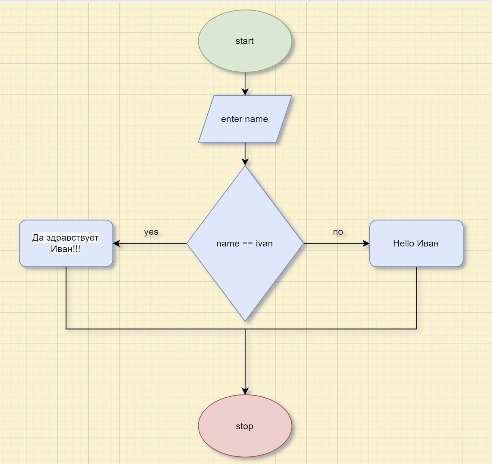

# Описание ввода задачи преветствия по имени
---

## 1. Создаем блок-схему

---

## 2. Создаем новый проект 
- Вводим команду ***dotnet new console*** и открываем фойл ***Program.cs***
- Прописываем код в соответствии с блок-схемой
- В терминале прописываем соманду ***dotnet run*** и наш програмный код выдает *особое* приветствия если имя пользователя ***Ivan***

## 3. Неверный ввод
Если введеное имя пользователя не ***Ivan***, то программа выдаст стандартное приветствие

